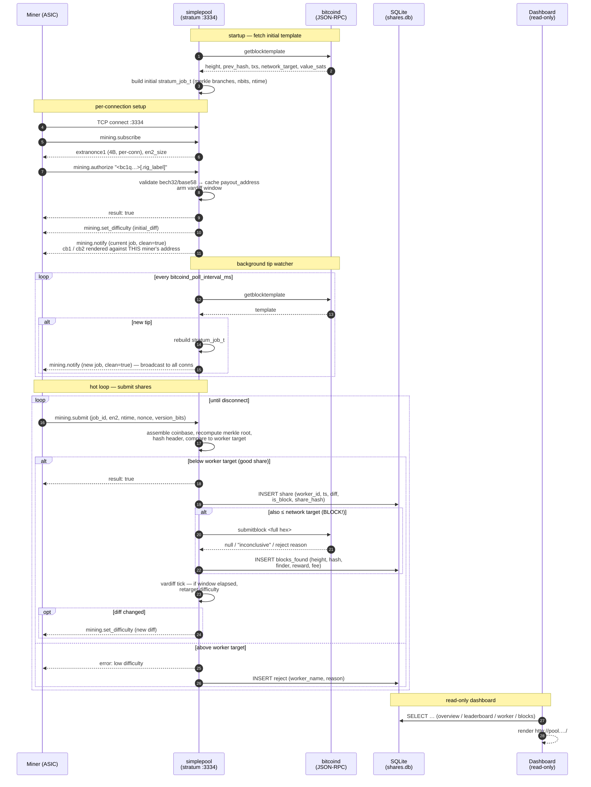

# simplepool

A small, single-binary **solo-mining stratum server** in pure C11. It accepts
miner connections on TCP `:3334`, builds block templates via `bitcoind`'s
`getblocktemplate`, submits found blocks via `submitblock`, and records every
accepted share into a local SQLite database. A separate Node.js dashboard
reads that file for stats.

Created by **Roberto Santacroce** —
source: <https://github.com/rsantacroce/simplepool>.

## About simplepool

> simplepool is the foundation for a PPS (Pay-Per-Share) mining pool
> that will eventually pay out using **Thunder**. We've released a
> solo-mining version alongside what we believe will be a genuinely
> useful tool for miners.
>
> The current implementation of shares, calculations, and related
> mechanics exists primarily to establish the **data model and
> architecture** that will underpin the future PPS billing system.
>
> A share is simply your submission from the work you've been assigned —
> it functions as a unit of account. From years of experience mining
> with pools, we've observed that auditing your own contributions is
> extremely difficult, often nearly impossible. Miners are forced to
> trust the pool's reporting, with little ability to independently
> verify what they're owed. simplepool aims to address this transparency
> gap. (Hopefully!)

This repository is the **solo build** — every share lands in the local
SQLite store, every accepted block is paid directly in its own coinbase,
and there is no off-chain accounting. The PPS build will be a separate
service that consumes the same data model; see the roadmap below.

It is a **solo pool with direct payouts**: every coinbase has two outputs —
the **miner who found the block gets the reward** (minus a small operator
fee), and the configured `operator_address` gets the rest (default 1% =
100 basis points, configurable via `fee_bps`). Each connected miner gets
its own coinbase rendered against the miner's own address; the merkle
branches, prev-hash, ntime, etc. are shared.

There is **no PPS**, no inter-miner reward sharing, and no
difficulty-weighted accounting. If your miner finds the block, your
address gets ~99% of the subsidy + fees on-chain in the same coinbase
transaction; if it doesn't, nobody on this proxy gets anything for that
height. The `shares` and `workers` tables exist purely so the dashboard
can show a leaderboard, per-worker drilldown, and historical "blocks
found by the pool" view.

### A note on terminology: "share" vs "work"

The codebase, schema, dashboard, and API all call accepted submissions
**shares** — never "work units." That's a deliberate choice we want to
hold even though this is currently solo-mode:

- *Share* is the canonical stratum term every miner knows. ASIC
  firmware, mining-pool dashboards, monitoring tools, and blog posts
  all use it. Reusing a different word here would just confuse the
  audience.
- The same column / table / API names will carry through to the PPS
  build, where shares **are** the unit of account that gets billed.
  Renaming `shares` → `work_units` now and back again later would
  churn schema, queries, EJS templates, and any external consumer.
- The meaning shift between solo and PPS is *semantic*, not lexical.
  We surface it with an explanatory banner on the dashboard and with
  the project blurb above, rather than by renaming things.

**In this solo build**, a share is an accepted Proof-of-Work submission
below the connection's worker target. It is *not* a payout claim and
does not accrue a balance — it exists for hashrate estimation,
per-rig accountability, and as the data primitive the upcoming PPS
billing engine will consume.

### How the solo flow actually works



Key invariants the diagram glosses over but the code enforces:

- **Per-connection coinbase.** Each miner's `cb1`/`cb2` pay *that*
  miner's address; the operator fee output is identical across miners.
  Two ASICs on the same address but different `.rig_label` get
  distinct `extranonce1` values, so their work never overlaps.
- **WAL writes are batched.** `store_record_share` enqueues into a
  lock-free ring; the writer thread commits batches every
  `commit_window_ms` (default 100) or every `commit_max_shares`
  (default 100), whichever first.
- **vardiff doesn't invalidate the active job.** A
  `mining.set_difficulty` only relaxes/tightens the per-share check;
  the current `mining.notify` stays valid against it. We do not force
  a re-notify on a difficulty change.

### Stratum username convention

The `mining.authorize` username must start with the miner's Bitcoin
address. Format:

```
<bitcoin_address>[.<rig_label>]
```

- `bitcoin_address` is required and must be a valid bech32 (P2WPKH) or
  base58check (P2PKH / P2SH) address. It is parsed at authorize time
  and an invalid address is rejected with a clear error and logged in
  the `rejects` table.
- `rig_label` is optional and lets a single miner (same address) have
  multiple rigs in the leaderboard as separate rows. Use anything
  alphanumeric plus `_` `-`.
- The **password is discarded** entirely. There are no accounts and no
  auth.

Examples: `bc1qabc…`, `bc1qabc….basement-rig`, `bcrt1q…test.alice`.

This is a **sibling project** to the Rust mining pool that lives elsewhere in
this same monorepo. The two share nothing in code or goals: the Rust pool is
a production-style PPS pool with payouts; `simplepool` is intentionally minimal
and exists for solo mining + observability only.

Status: **wired**. The main binary loads config, connects to bitcoind,
opens the SQLite store, builds an initial job from `getblocktemplate`,
serves stratum on the configured port, and watches for new tips on a
background thread.

## Build

Dependencies: `sqlite3`, `libcurl`, `pthread`, plus a C11 compiler.

macOS:
```
brew install sqlite curl
make
```

Debian / Ubuntu:
```
sudo apt install build-essential libsqlite3-dev libcurl4-openssl-dev
make
```

The binary lands at `build/simplepool`.

## Run

```
cp proxy.conf.example proxy.conf
# edit proxy.conf
./build/simplepool proxy.conf
```

Initialise the SQLite database from the shipped schema:
```
mkdir -p data
sqlite3 data/shares.db < schema.sql
```

## Database & dashboard snapshot

The proxy is the only writer. The database lives at `data/shares.db` and
runs in WAL mode, so a read-only consumer cannot block writes or corrupt
the file.

For the dashboard we still recommend pointing it at a **separate snapshot
file** rather than the live DB. This isolates the dashboard's query load
from the proxy's writer and means a future code change on the dashboard
side can never accidentally open the live file read-write.

Use SQLite's online backup — it is atomic and safe to run while the proxy
is writing. A plain `cp` of a WAL'd database is **not** safe; always use
`.backup`:

```
# one-shot
sqlite3 data/shares.db ".backup data/shares.snapshot.db"
```

Run it on a timer (cron / systemd-timer / launchd), e.g. every minute:

```
* * * * * sqlite3 /path/to/data/shares.db ".backup /path/to/data/shares.snapshot.db"
```

The dashboard reads `data/shares.db` (the live DB) by default. Point it
at a snapshot via `PROXY_DB_PATH` if you want — see
[`dashboard/README.md`](dashboard/README.md).

## Deploy to a server

There's a one-shot deploy script that brings a fresh Ubuntu 24.04 box
from nothing to fully serving stratum + dashboard behind nginx. It is
idempotent: re-run it after every code change.

```
./scripts/deploy-to-server.sh \
    --host     user@host \
    --root     /home/user/simplepool \
    --hostname pool.example.com \
    --ssh-key  ~/.ssh/id_yourkey
```

What the script does, end to end:

1.  `git fetch && git reset --hard origin/main` on the remote checkout.
2.  `apt-get install` build deps + nodejs + sqlite3 + nginx + ufw.
3.  `make` the C proxy.
4.  `npm install` in `dashboard/`.
5.  Initialise `data/shares.db` from `schema.sql` if missing.
6.  Run the one-shot ms→seconds timestamp migration (idempotent — it
    only updates rows where `ts > 10^10`, which can only be milliseconds).
7.  Render the two systemd unit templates in [`deploy/systemd/`](deploy/systemd/)
    with the right user / root path, install to `/etc/systemd/system/`,
    `enable --now` both.
8.  Drop the nginx vhost from [`deploy/nginx/`](deploy/nginx/) into
    `sites-available`, symlink to `sites-enabled`, `nginx -t && reload`.
    Open ports 80 / 443 / 3334 via `ufw` if active.

Files in [`deploy/`](deploy/) are templates with `@USER@` and `@ROOT@`
placeholders the script substitutes — feel free to hand-install them if
you want to do the steps yourself.

Stratum is raw TCP, not HTTP, so it does **not** go through nginx by
default. Miners connect directly to `host:3334`. Point your stratum
hostname (e.g. `stratum.example.com`) at the box's IP via DNS; if you
ever need TLS for stratum, you'd add a `stream { ... }` block to nginx
or use `stunnel`.

### Operations

```
sudo systemctl status   simplepool simplepool-dashboard nginx
sudo journalctl -u simplepool           -f      # stratum log
sudo journalctl -u simplepool-dashboard -f      # dashboard log
sudo systemctl restart  simplepool              # after pulling new code
```

To pull edits made directly on a server back into a local checkout (so
you can commit + push from here), use
[`scripts/sync-from-server.sh`](scripts/sync-from-server.sh).

## Config keys

```
operator_address = bc1q...   # required: recipient of the fee_bps cut
fee_bps          = 100       # 100 = 1%; valid range 0..1000 (max 10%)
coinbase_tag     = /simplepool/ # short string baked into the coinbase scriptSig
```

`fee_bps = 0` disables the fee output (single-payout coinbase, all to
the miner). If the computed fee would be below the relay dust threshold
(~546 sats) the operator output is dropped automatically and the miner
gets the full reward.

`bitcoind_user` / `bitcoind_pass` are optional: omit both for a
block-template backend that accepts unauthenticated JSON-RPC, and the
proxy issues the RPC call without a basic-auth header. Set
`log_level = debug` to log every RPC request and raw response.

## How shares are credited

One accepted share = one row in the `shares` table, tagged with the
`worker_id` resolved from the (sanitized) stratum username — which now
encodes the miner's payout address. The `workers` row stores
`payout_address` separately so the dashboard can also roll up by
address across multiple rigs.

If a share also satisfies the network target, it is additionally
recorded in `blocks_found` with `height`, `hash`, `finder_id`,
`finder_address`, `reward_sats` (paid to the miner), and `fee_sats`
(paid to `operator_address`). The matching `shares` row has
`is_block = 1` and the block hash.

## Run against local regtest

The repo ships a best-effort integration test that exercises the proxy
end-to-end against a regtest `bitcoind`:

```
# bitcoind must already be running with -regtest, RPC on 127.0.0.1:18443,
# user/password "drivepool"/"drivepool" (or override with env vars).
chmod +x tests/test_integration.sh
./tests/test_integration.sh
```

The script:

1. Skips with exit 0 if `bitcoin-cli`, `nc`, or `sqlite3` are missing, or
   if no regtest node is reachable.
2. Mines 101 blocks if needed so templates are non-empty.
3. Writes `tests/integration.proxy.conf` and starts `./build/simplepool` on
   `127.0.0.1:13334` with the DB at `/tmp/simplepool-int.db`.
4. Sends a tiny `mining.subscribe` / `mining.authorize` / stale
   `mining.submit` sequence over `nc`, then `SIGINT`s the proxy.
5. Asserts that `workers` has at least one row, `workers.payout_address`
   is populated, and `rejects` has at least one row.

For the broader stack flow (Docker compose, Rust pool, dashboard) see
[`../docs/TESTING.md`](../docs/TESTING.md).

## Layout

```
Makefile             # build / clean / test / format / install
schema.sql           # SQLite schema (WAL, 4 tables — workers, shares,
                     # rejects, blocks_found)
proxy.conf.example   # key = value config
src/
  main.c             # entry point: config + bitcoind + store + stratum + tip watcher
  config.{c,h}       # tiny key=value config parser
  coinbase.{c,h}     # BIP34 coinbase tx builder; bech32 + base58check decoders
  log.{c,h}          # tiny pthread-safe stderr logger
  share.{c,h}        # share-validation math
  sha256.{c,h}       # vendored SHA-256
  stratum.{c,h}      # stratum v1 server
  store.{c,h}        # SQLite writer with batching
  bitcoind.{c,h}     # libcurl-based JSON-RPC client
  cjson/             # vendored cJSON (MIT) — see src/cjson/README.md
include/             # public headers (empty for now)
tests/               # unit tests + integration shell script
deploy/              # systemd unit templates + nginx vhost templates
scripts/             # deploy + sync helpers
dashboard/           # Node/Express read-only stats UI
```

## Roadmap

The solo build is intentionally minimal; the items below extend it
toward the full simplepool PPS pool without changing the share/block data
model that already lives in `schema.sql`.

1. **Move persistence behind Redis.** Add a Redis-backed write path
   alongside the SQLite store so the hot share queue isn't bound to a
   single-writer file. SQLite stays as the durable archive; Redis
   absorbs the high-frequency writes and makes the share stream
   consumable by other services in real time.
2. **PPS billing as a separate, non-blocking service.** Run the
   Pay-Per-Share build on its own port / instance. The billing engine
   consumes the share stream (Redis) and settles payouts over
   **Thunder**. Strict separation: a billing outage must never block
   the stratum proxy from accepting work or submitting blocks.
3. **Miner registration for the PPS pool.** Endpoint + flow for miners
   to register a payout address, a withdrawal threshold, and any
   per-account settings the PPS engine needs. The solo build doesn't
   need this — solo miners are identified by the address embedded in
   the stratum username — but PPS does.
4. **Status and observability.** Expose Prometheus-style metrics
   (`/metrics`), structured logs, and per-connection health for both
   the proxy and the billing service. The goal is for any miner to be
   able to audit their own contribution end to end without having to
   trust an opaque "pool dashboard."
5. **Richer dashboard metrics.** Build on the current overview / per-
   worker / blocks pages with per-rig hashrate variance, expected-vs-
   observed payouts, network-difficulty overlays, and historical
   charts that go beyond the rolling 24-hour window.
6. **Decouple the dashboard from the live database.** Have the
   dashboard read its own derived store (a Redis replica or a periodic
   materialised view) rather than the proxy's primary SQLite file.
   That keeps the dashboard's read pattern from ever touching the hot
   write path.

## Author

**Roberto Santacroce** — <https://github.com/rsantacroce/simplepool>

Issues, pull requests, and notes from miners running this in the wild
are all welcome.

## License

simplepool is released under the **MIT License**, © 2026 Roberto
Santacroce (see [`LICENSE`](LICENSE)).
The vendored cJSON code in `src/cjson/` is also MIT-licensed (see
[`src/cjson/README.md`](src/cjson/README.md)).
