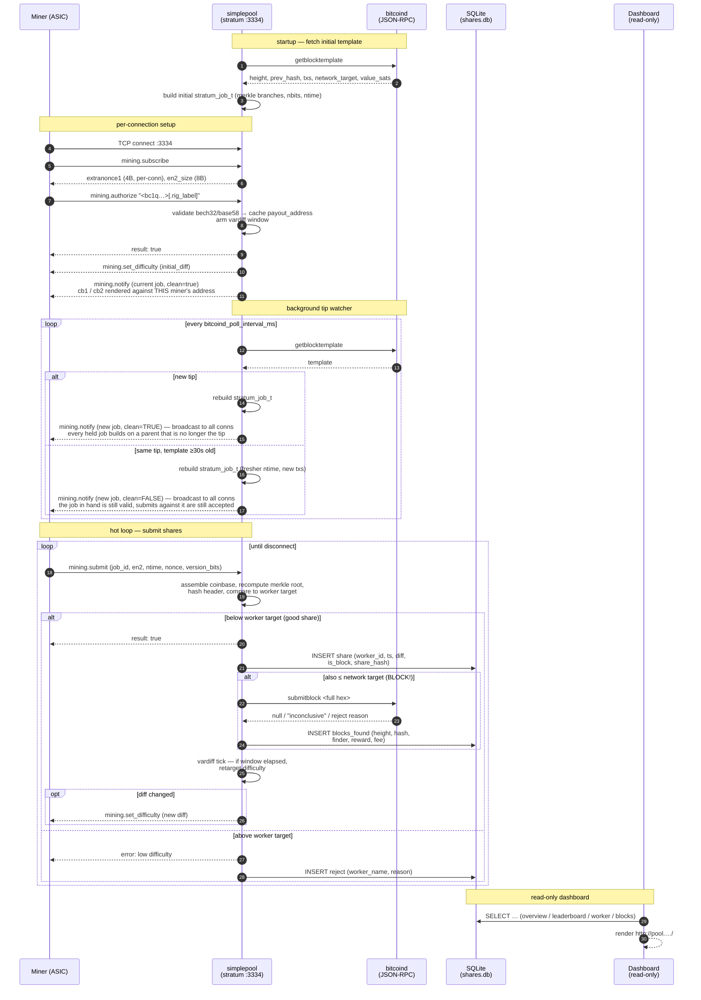

# simplepool

A small, single-binary **stratum server** in pure C11. It accepts miner
connections on TCP `:3334`, builds block templates via `bitcoind`'s
`getblocktemplate`, submits found blocks via `submitblock`, and records every
accepted share into a local SQLite database. A separate Node.js dashboard
reads that file for stats.

It runs in five modes, which differ in who carries the variance and who holds
the money in between: **solo**, where the miner who finds a block is paid in
that block's own coinbase; **pps-classic**, where every accepted share earns a
derivable amount and the operator absorbs the variance out of a reserve;
**pplns-thunder** / **pplns-btc**, where a matured block is split across the
shares that produced it, so the miners carry the variance and the pool never
owes more than it has just been paid; and **pplns-coinbase**, which is that
same PPLNS accounting with the custody removed — the block's own coinbase pays
the whole window directly, one output per miner. All five ship in this repo —
see [The five modes](#the-five-modes) below.

Created by **Roberto Santacroce**.
Canonical repository: <https://github.com/LayerTwo-Labs/simplepool>.

```sh
curl -fsSL https://raw.githubusercontent.com/LayerTwo-Labs/simplepool/main/scripts/install.sh | sudo bash
```

## About simplepool

> simplepool is the foundation for a PPS (Pay-Per-Share) mining pool
> that will eventually pay out using **Thunder**. We've released a
> solo-mining version alongside what we believe will be a genuinely
> useful tool for miners.
>
> The current implementation of shares, calculations, and related
> mechanics exists primarily to establish the **data model and
> architecture** that will underpin the future PPS billing system.
>
> A share is simply your submission from the work you've been assigned —
> it functions as a unit of account. From years of experience mining
> with pools, we've observed that auditing your own contributions is
> extremely difficult, often nearly impossible. Miners are forced to
> trust the pool's reporting, with little ability to independently
> verify what they're owed. simplepool aims to address this transparency
> gap. (Hopefully!)

> A single-file, no-JavaScript explainer covering every mode end to end —
> shares, difficulty, the coinbase, PPS credit, Thunder payouts and how to
> audit every number — lives at [`docs/simplepool.html`](docs/simplepool.html),
> published at **<https://layertwo-labs.github.io/simplepool/>**. Open it from
> disk or serve it next to the dashboard.

### The five modes

This repository ships **all five**, selected by `pool_mode` in
`proxy.conf`. They differ in two independent things — who the coinbase pays,
and what a stratum username is:

| `pool_mode` | coinbase pays | username | who carries the variance |
| --- | --- | --- | --- |
| `solo` | the miner who found it | Bitcoin address | nobody: you are paid what you find |
| `pps-classic` | the pool | Thunder address | the operator, out of a reserve |
| `pplns-thunder` | the pool | Thunder address | the miners |
| `pplns-btc` | the pool | Bitcoin address | the miners |
| `pplns-coinbase` | **the whole window, directly** | Bitcoin address | the miners |

- **`pool_mode = solo`** (default) — every share lands in the local
  SQLite store, every accepted block is paid directly in its own
  coinbase to the miner who found it, and there is no off-chain
  accounting. Stratum username is a Bitcoin address.
- **`pool_mode = pps-classic`** — every accepted block's coinbase pays a
  single pool-owned BTC wallet (`pool_btc_address`) as a normal output.
  Each accepted share credits the miner's `pps_credits.accrued_sats` at
  a rate the proxy **derives from each block template** — the block's
  own value over the network difficulty, net of `fee_bps` — so the
  price of a share tracks the chain instead of going stale.
  (`pps_sats_per_diff` exists to pin that rate and should be left
  unset: a pinned value silently bypasses `fee_bps` and cannot follow a
  retarget.) The operator batches the
  accumulated BTC into the pool's Thunder reserve from the admin
  dashboard, and a separate payout service (not in this binary) issues
  Thunder transactions to drain those credits to miners. Stratum
  username is a bare base58 Thunder address — the deposit-format wrapper
  `s9_<base58>_<hex6>` is rejected, since Thunder itself doesn't
  recognize it at the byte level.

  Payouts run as a **daily batch**: once every 24h everyone over
  `PAYOUT_MIN_SATS` goes out in a single Thunder transaction. Settlement of
  an already-broadcast batch runs on its own 30-second clock, because nobody
  in a batch is credited until a tick observes it in a Thunder block. See
  [`payout/README.md`](payout/README.md) for all three clocks.

  > An earlier `pool_mode = pps` put a BIP300 drivechain deposit
  > directly in each coinbase, so the pool would never custody BTC.
  > Regtest and forknet both showed the enforcer does *not* credit
  > coinbase outputs as deposits — the block confirms but the sidechain
  > Ctip never moves, stranding the reward. That mode has been removed;
  > see [`CLASSIC_PAYOUTS.md`](CLASSIC_PAYOUTS.md) for the evidence and
  > the design that replaced it.

- **`pool_mode = pplns-thunder`** and **`pool_mode = pplns-btc`** — the
  coinbase pays the pool, exactly as in `pps-classic`, but **nothing is
  credited when a share arrives**. Instead, once a block has matured **100
  confirmations** it is split across the shares that produced it — walking
  back from the block's own share until their difficulty fills a window —
  and each miner is credited its proportion of `(reward + fees)`, net of
  `fee_bps`.

  That is the whole difference, and it is a difference about risk. PPS
  prices a share the moment it arrives, whether or not it ever becomes a
  block, so the operator needs a reserve measured in block rewards to
  absorb the gap. Under PPLNS the pool never owes more than it has just
  been paid: there is no reserve to size and operator ruin is not a failure
  mode. The miners carry the variance instead, which is what makes it the
  mode a small pool can actually run.

  Two consequences worth stating, because each has a plausible-looking
  wrong answer:

  - **Maturity, not confirmation.** A coinbase output is unspendable until
    it is 100 deep, so crediting at confirmation would create a balance the
    pool genuinely cannot fund — the reserve requirement PPLNS exists to
    remove, reintroduced by accident. Waiting also disposes of the orphan
    question rather than answering it: crediting is additive and there is
    no negative share, so a credit from a block that turns out not to be
    ours could not be taken back. At 100 deep that stops being a risk.
  - **Transaction fees are included**, unlike pure PPS: PPLNS shares what
    the block actually earned.

  The window is `pplns_window_diff_multiple` × the network difficulty
  (default 2.0, "the last two blocks' worth of expected work"), a multiple
  rather than an absolute share count so it self-scales across retargets.
  It is snapshotted onto the block row when the block is found, not
  recomputed when it is paid: those moments are ~100 blocks apart and the
  chain can retarget in between.

  These two differ only in the rail the balance is finally paid over, and
  that choice is what a stratum username has to be. (The third PPLNS mode,
  `pplns-coinbase` below, has no balance and no rail at all — it pays out of
  the block itself.)

  - **`pplns-thunder`** pays over Thunder, like `pps-classic`, and reuses
    the same payout worker draining the same `pps_credits` table. Username
    is a bare base58 Thunder address.
  - **`pplns-btc`** pays on Bitcoin L1, by asking the enforcer's own wallet
    to send. Username is a Bitcoin address. This requires
    `bip300301_enforcer` running with `--enable-wallet`, with
    `pool_btc_address` an address from that wallet, and the payout worker
    started with `PAYOUT_RAIL=btc` — the proxy says so at startup, because
    otherwise the first sign of a misconfiguration is a payout failing 100
    blocks after the block was found.

  One rail per pool, encoded in `pool_mode` rather than a mode plus a
  separate rail knob, so the inconsistent configuration is unrepresentable
  rather than merely rejected.

- **`pool_mode = pplns-coinbase`** — the same PPLNS accounting as the two
  rails above, with the custody taken out. There is no pool wallet, no
  payout worker, no `pps_credits` row and no maturity wait: the block's own
  coinbase pays the entire window directly, one output per miner, largest
  claim first. A reorged block simply never paid, so there is nothing to
  claw back. Username is a Bitcoin address.

  The window is snapshotted onto the job when the template is built, so the
  coinbase pays the work that exists *now* rather than work from 100 blocks
  ago. On a drivechain the coinbase comes from the CUSF enforcer, and its
  BIP300/301 commitment `OP_RETURN`s are preserved byte-for-byte — only the
  enforcer's own reward output is replaced, by the window.

  **Two limits decide how many miners one block can pay:**

  - `coinbase_max_bytes` (default 1000) budgets the *whole serialized
    coinbase*, commitments included, because that is what a rented-hashrate
    marketplace measures when it decides a job is oversized. A production
    coinbase-direct pool reports whole coinbases of 721–817 bytes paying up
    to 16 miners, where the same 16 payouts cost 817 bytes against four
    drivechain `OP_RETURN`s and 769 against three. A cap counted in outputs
    cannot see that; a byte budget can.

    It is settable **per listener**, and usually should be. The ceiling is a
    marketplace rule enforced on the port the rented hashrate connects to, and
    every byte of it costs a payout — a 100-miner window pays 9 at 400 bytes
    and 93 at 3000 — so there is no reason to make your own miners live under a
    limit their port is never measured against:

    ```
    coinbase_max_bytes = 3000
    listener = port=3335 label=rental min_diff=500000 initial_diff=500000 max_coinbase_bytes=900
    ```

    A listener that sets none uses the server-wide value.
  - `pplns_payout_floor_sats` (default 546, the dust limit) is the minimum
    a claim must be worth to get an output at all.

  **A claim that clears neither is paid to the other miners in the window,
  not to the operator.** The block still pays out to the satoshi, the pool
  still holds nothing, and the operator still takes only its fee.

  > This was the other way round until [#76][pr76]. A dropped claim used to
  > ride on the operator's output, defended as a dust policy. Measurement
  > killed it: with 100 miners on a 1/n hashrate spread and the default
  > budget, 28 were paid, **72 were cut by the byte cap and none by the dust
  > floor**, and the operator received **25% of the block on a 1% fee**. The
  > take also rose as the coinbase shrank — 46% at 400 bytes against 2% at
  > 3000 — so starving your own miners was the revenue-maximising move.
  > Credit to [@Wired4ncer][pr76], who runs the pool that showed it.

  **Being small costs you frequency, not money.** A miner's share of the
  window tracks its hashrate, so without help the largest claims would take
  the same slots every block and the same addresses would never be paid at
  all. A quarter of each coinbase's slots are therefore reserved for whoever
  has waited longest, tracked in `pplns_fractions`: a signed fraction of one
  block reward per worker, positive if you were skipped and negative if you
  were paid early out of someone else's skipped share. The column sums to
  zero.

  That is **not a balance and the pool holds nothing against it**. Nothing is
  ever withheld from a coinbase and released later — that would need a block
  paying less than the reward followed by one paying more, and the second is
  invalid. Delete the table and nobody is owed a payment; the pool just
  forgets whose turn it was. Rows are staged when a block is found and applied
  only once it is confirmed, so an orphaned block — which paid nobody —
  rotates nobody.

  "Confirmed" means one block deep, not a hundred: the queue has to reflect
  the last block before the next one is built, and money is not at stake. The
  cost is that a block reorged out *after* that first confirmation keeps its
  rotation — the miners it paid stay at the back of the queue and the ones it
  skipped stay at the front — for a payment that never stood. That is one turn
  out of order, never a satoshi, and the next block found corrects it.

  **If the pool cannot measure the window, it publishes no job at all.** The
  window is read back over a bounded walk of the shares table; if that walk
  cannot prove it covered the configured window — an IO error, a lock held too
  long — it returns an error rather than a short answer, and the template is
  held back. Miners keep working the last job until it recovers, which costs
  hashrate on a new tip but is the only safe direction: in this mode the window
  is rendered into a coinbase and published, so a wrong one is mined,
  irreversible, and invisible afterwards. `pplns window walk did not cover …`
  in the log is that guard firing, not a crash.

  The floor is disclosed in four places: the proxy states it at startup, logs
  how many miners in the current window fall below it, reports per block what
  was redistributed and to whom — and publishes the number to `pool_meta`, so
  the **dashboard states it to miners before they connect**. That last one is
  the one that matters: the operator's log is the one place the miner it
  affects cannot look.

[pr76]: https://github.com/LayerTwo-Labs/simplepool/pull/76

In every mode the operator fee stays in BTC, paid to `operator_address`
out of the same coinbase. On PPLNS it is normally set lower than on PPS:
there is no variance being absorbed, so there is no risk premium to charge
for. See [`proxy.conf.example`](proxy.conf.example) for the full set of
PPS / PPLNS / Thunder keys.

Optional: set `redis_url` to mirror accepted shares, rejects, blocks,
tip changes and PPS credits to Redis pub/sub channels (`pool:shares`,
`pool:rejects`, `pool:blocks`, `pool:tip`, `pool:credits`) for the
dashboard and any downstream consumers. SQLite remains the source of
truth; the publish is fire-and-forget.

**In `solo` mode** it is a solo pool with direct payouts: every coinbase has
two outputs — the **miner who found the block gets the reward** (minus a small
operator fee), and the configured `operator_address` gets the rest (default
1% = 100 basis points, configurable via `fee_bps`). Each connected miner gets
its own coinbase rendered against the miner's own address; the merkle
branches, prev-hash, ntime, etc. are shared.

In that mode there is no inter-miner reward sharing and no difficulty-weighted
accounting. If your miner finds the block, your address gets ~99% of the
subsidy + fees on-chain in the same coinbase transaction; if it doesn't,
nobody on this proxy gets anything for that height. The `shares` and `workers`
tables exist so the dashboard can show a leaderboard, per-worker drilldown,
and historical "blocks found by the pool" view.

**In `pps-classic` mode** that inverts: the coinbase pays the pool, every
accepted share credits a balance at a rate derived from the live block
template, and the pool — not the miner — carries the variance.

**In the `pplns-*` modes** the coinbase also pays the pool, but no balance
moves until a block matures; it is then divided among the shares that
produced it. Nobody is paid for work that did not become a block, which is
precisely why the pool needs no reserve.

### A note on terminology: "share" vs "work"

The codebase, schema, dashboard, and API all call accepted submissions
**shares** — never "work units." That's a deliberate choice we want to
hold even though this is currently solo-mode:

- *Share* is the canonical stratum term every miner knows. ASIC
  firmware, mining-pool dashboards, monitoring tools, and blog posts
  all use it. Reusing a different word here would just confuse the
  audience.
- The same column / table / API names will carry through to the PPS
  build, where shares **are** the unit of account that gets billed.
  Renaming `shares` → `work_units` now and back again later would
  churn schema, queries, EJS templates, and any external consumer.
- The meaning shift between solo and PPS is *semantic*, not lexical.
  We surface it with an explanatory banner on the dashboard and with
  the project blurb above, rather than by renaming things.

**In `solo` mode**, a share is an accepted Proof-of-Work submission below the
connection's worker target. It is *not* a payout claim and does not accrue a
balance — it exists for hashrate estimation, per-rig accountability, and as
the data primitive the PPS billing path consumes. **In `pps-classic`** the
same row additionally carries `credited_sats` and the `rate_used` that
produced it, and *is* the unit of account.

### How the solo flow actually works


```mermaid
sequenceDiagram
    autonumber
    participant M as Miner (ASIC)
    participant P as simplepool<br/>(stratum :3334)
    participant B as bitcoind<br/>(JSON-RPC)
    participant S as SQLite<br/>(shares.db)
    participant D as Dashboard<br/>(read-only)

    Note over P,B: startup — fetch initial template
    P->>B: getblocktemplate
    B-->>P: height, prev_hash, txs, network_target, value_sats
    P->>P: build initial stratum_job_t (merkle branches, nbits, ntime)

    Note over M,P: per-connection setup
    M->>P: TCP connect :3334
    M->>P: mining.subscribe
    P-->>M: extranonce1 (4B, per-conn), en2_size (8B)
    M->>P: mining.authorize "<bc1q…>[.rig_label]"
    P->>P: validate bech32/base58 → cache payout_address<br/>arm vardiff window
    P-->>M: result: true
    P-->>M: mining.set_difficulty (initial_diff)
    P-->>M: mining.notify (current job, clean=true)<br/>cb1 / cb2 rendered against THIS miner's address

    Note over P,B: background tip watcher
    loop every bitcoind_poll_interval_ms
        P->>B: getblocktemplate
        B-->>P: template
        alt new tip
            P->>P: rebuild stratum_job_t
            P-->>M: mining.notify (new job, clean=TRUE) — broadcast to all conns<br/>every held job builds on a parent that is no longer the tip
        else same tip, template ≥30s old
            P->>P: rebuild stratum_job_t (fresher ntime, new txs)
            P-->>M: mining.notify (new job, clean=FALSE) — broadcast to all conns<br/>the job in hand is still valid, submits against it are still accepted
        end
    end

    Note over M,P: hot loop — submit shares
    loop until disconnect
        M->>P: mining.submit (job_id, en2, ntime, nonce, version_bits)
        P->>P: assemble coinbase, recompute merkle root,<br/>hash header, compare to worker target
        alt below worker target (good share)
            P-->>M: result: true
            P->>S: INSERT share (worker_id, ts, diff,<br/>is_block, share_hash)
            alt also ≤ network target (BLOCK!)
                P->>B: submitblock <full hex>
                B-->>P: null / "inconclusive" / reject reason
                P->>S: INSERT blocks_found (height, hash,<br/>finder, reward, fee)
            end
            P->>P: vardiff tick — if window elapsed,<br/>retarget difficulty
            opt diff changed
                P-->>M: mining.set_difficulty (new diff)
            end
        else above worker target
            P-->>M: error: low difficulty
            P->>S: INSERT reject (worker_name, reason)
        end
    end

    Note over D,S: read-only dashboard
    D->>S: SELECT … (overview / leaderboard / worker / blocks)
    D-->>D: render http://pool.…/
```

Key invariants the diagram glosses over but the code enforces:

- **Per-connection coinbase.** Each miner's `cb1`/`cb2` pay *that*
  miner's address; the operator fee output is identical across miners.
  Two ASICs on the same address but different `.rig_label` get
  distinct `extranonce1` values, so their work never overlaps.
- **WAL writes are batched.** `store_record_share` enqueues into a
  lock-free ring; the writer thread commits batches every
  `commit_window_ms` (default 100) or every `commit_max_shares`
  (default 100), whichever first.
- **vardiff doesn't invalidate the active job.** A
  `mining.set_difficulty` only relaxes/tightens the per-share check;
  the current `mining.notify` stays valid against it. We do not force
  a re-notify on a difficulty change. Each job also carries the
  difficulty it went out under, so a submit is judged at *that* value
  rather than whatever the connection has drifted to since.
- **`clean_jobs` is an instruction, not a description.** It means
  "throw away the work you are holding", and only a tip change makes
  that true. The periodic template refresh sends `clean_jobs=false`:
  the job in hand still builds on the current tip, and the pool goes on
  accepting submits against it out of an 8-deep retention ring. Sending
  it as true on every refresh discards work in flight on every
  connected miner ~20 times per block, which is invisible to a probe
  that reads one notify and leaves.
- **More than one stratum port.** A `listener` line binds an extra port
  with its own difficulty policy, so a rented fleet and a home ASIC can
  be served by the same pool without either getting the other's
  difficulty. `listen_port` is unaffected, and a config naming no
  listeners binds exactly what it always did.

### Stratum username convention

The `mining.authorize` username must start with the miner's Bitcoin
address. Format:

```
<bitcoin_address>[.<rig_label>]
```

- `bitcoin_address` is required and must be a valid bech32 (P2WPKH) or
  base58check (P2PKH / P2SH) address. It is parsed at authorize time
  and an invalid address is rejected with a clear error and logged in
  the `rejects` table.
- `rig_label` is optional and lets a single miner (same address) have
  multiple rigs in the leaderboard as separate rows. Use anything
  alphanumeric plus `_` `-`.
- The **password is discarded** entirely. There are no accounts and no
  auth.

Examples: `bc1qabc…`, `bc1qabc….basement-rig`, `bcrt1q…test.alice`.

`simplepool` is deliberately small: one C binary for the hot path, one
read-only Node dashboard, one Node payout worker, and a SQLite file that is
the source of truth for all three. Nothing in the stratum path depends on the
dashboard or the payout worker being up — a billing outage must never stop the
pool accepting work or submitting blocks.

## Install

On a fresh Ubuntu or Debian server:

```sh
curl -fsSL https://raw.githubusercontent.com/LayerTwo-Labs/simplepool/main/scripts/install.sh | sudo bash
```

That downloads the published build for the machine's architecture, checks it
against the release `SHA256SUMS`, then interviews you for the rest — pool mode,
bitcoind RPC, your operator address, dashboard domain, nginx and TLS — and
leaves a running pool behind nginx with a `simplepoolctl` command to drive it.
No compiler and no clone: `--from-source` if you want those instead. Answers
are saved, so re-running it is how you change your mind about any of them.

```sh
simplepoolctl status      # what's running, on which ports, at which version
simplepoolctl doctor      # check the things that actually break in production
simplepoolctl logs -f     # follow every service at once
simplepoolctl upgrade     # move to the next release, then restart
simplepoolctl uninstall   # remove the services (--purge also drops the data)
```

Full walkthrough, including the manual steps the script automates, is in
[INSTALL.md](INSTALL.md). To cut a release, see [RELEASING.md](RELEASING.md).

## Build from source

Dependencies: `sqlite3`, `libcurl`, `libhiredis`, `pthread`, plus a C11 compiler.

macOS:
```
brew install sqlite curl hiredis
make
```

Debian / Ubuntu:
```
sudo apt install build-essential libsqlite3-dev libcurl4-openssl-dev libhiredis-dev
make
```

The binary lands at `build/simplepool`.

## Run

```
cp proxy.conf.example proxy.conf
# edit proxy.conf
./build/simplepool proxy.conf
```

Initialise the SQLite database from the shipped schema:
```
mkdir -p data
sqlite3 data/shares.db < schema.sql
```

## Database & dashboard snapshot

The proxy is the only writer. The database lives at `data/shares.db` and
runs in WAL mode, so a read-only consumer cannot block writes or corrupt
the file.

For the dashboard we still recommend pointing it at a **separate snapshot
file** rather than the live DB. This isolates the dashboard's query load
from the proxy's writer and means a future code change on the dashboard
side can never accidentally open the live file read-write.

Use SQLite's online backup — it is atomic and safe to run while the proxy
is writing. A plain `cp` of a WAL'd database is **not** safe; always use
`.backup`:

```
# one-shot
sqlite3 data/shares.db ".backup data/shares.snapshot.db"
```

Run it on a timer (cron / systemd-timer / launchd), e.g. every minute:

```
* * * * * sqlite3 /path/to/data/shares.db ".backup /path/to/data/shares.snapshot.db"
```

The dashboard reads `data/shares.db` (the live DB) by default. Point it
at a snapshot via `PROXY_DB_PATH` if you want — see
[`dashboard/README.md`](dashboard/README.md).

## Deploy to a server

[`scripts/install.sh`](scripts/install.sh) (see [Install](#install) above) is
the way to bring a box up from nothing. `scripts/deploy-to-server.sh` is the
other direction: it drives an *already installed* box from your workstation,
which is what you want while iterating on code that isn't released yet. It is
idempotent: re-run it after every change.

```
./scripts/deploy-to-server.sh \
    --host     user@host \
    --root     /home/user/simplepool \
    --hostname pool.example.com \
    --ssh-key  ~/.ssh/id_yourkey
```

What the script does, end to end:

1.  `git fetch && git reset --hard origin/main` on the remote checkout.
2.  `apt-get install` build deps + nodejs + sqlite3 + nginx + ufw.
3.  `make` the C proxy.
4.  `npm install` in `dashboard/`.
5.  Initialise `data/shares.db` from `schema.sql` if missing.
6.  Run the one-shot ms→seconds timestamp migration (idempotent — it
    only updates rows where `ts > 10^10`, which can only be milliseconds).
7.  Render the two systemd unit templates in [`deploy/systemd/`](deploy/systemd/)
    with the right user / root path, install to `/etc/systemd/system/`,
    `enable --now` both.
8.  Drop the nginx vhost from [`deploy/nginx/`](deploy/nginx/) into
    `sites-available`, symlink to `sites-enabled`, `nginx -t && reload`.
    Open ports 80 / 443 / 3334 via `ufw` if active.

Files in [`deploy/`](deploy/) are templates with `@USER@` and `@ROOT@`
placeholders the script substitutes — feel free to hand-install them if
you want to do the steps yourself.

Stratum is raw TCP, not HTTP, so it does **not** go through nginx by
default. Miners connect directly to `host:3334`. Point your stratum
hostname (e.g. `stratum.example.com`) at the box's IP via DNS; if you
ever need TLS for stratum, you'd add a `stream { ... }` block to nginx
or use `stunnel`.

### Operations

```
simplepoolctl status                            # services, ports, ledger totals
simplepoolctl logs proxy -f                     # stratum log
simplepoolctl logs dashboard -f                 # dashboard log
sudo simplepoolctl restart proxy                # after changing proxy.conf
```

`simplepoolctl` is a wrapper over systemd — the underlying commands
(`systemctl status simplepool`, `journalctl -u simplepool -f`) work exactly as
before, and are what it prints when something needs a closer look.

To pull edits made directly on a server back into a local checkout (so
you can commit + push from here), use
[`scripts/sync-from-server.sh`](scripts/sync-from-server.sh).

### Docker

An alternative to the bare-metal script: containerized builds of the
four services (stratum proxy, dashboard, payout worker, slipstream) under
[`deploy/docker/`](deploy/docker/). One `docker compose up -d --build`
gets the whole app stack running against a Thunder daemon and Bitcoin
Core that live on the host (or wherever you point them). Shared bind
mount on `data/` so the SQLite ledger is portable across restarts /
image rebuilds. See [`deploy/docker/README.md`](deploy/docker/README.md)
for the full walkthrough.

Note: the drivechain infrastructure (`bitcoind`, Thunder, the
`bip300301_enforcer`, `electrs`) is intentionally NOT containerized —
those daemons have their own lifecycles and typically run bare-metal on
the same host.

### Slipstream

[`slipstream/`](slipstream/) is an optional service that takes a raw tx from
anyone and gets it into the pool's blocks, including txs the network will not
relay: BIP300/301 txs, or any other consensus-valid tx. It checks each one
against the pool's own bitcoind (`testmempoolaccept`) and the fee rule, then
broadcasts it there; the enforcer's template mempool mirrors that node's, so it
reaches the templates the proxy mines with no enforcer change. Non-standard txs
need the node to run `-acceptnonstdtxn` (which Core allows only off mainnet).
The fee rule is Slipstream's: the higher of a 1 sat/vB floor and the current
mineable rate. Every submission is kept, and each accepted tx is followed from
template to block. It also serves the pool's `info.json` for pool directories.
It is not set up by `install.sh` yet: the systemd unit and nginx vhost are
templates in [`deploy/`](deploy/), and [`slipstream/README.md`](slipstream/README.md)
walks through installing them. [`docs/simplepool.html`](docs/simplepool.html)
explains it end to end.

### Telegram broadcaster

[`broadcaster/`](broadcaster/) is an optional service that posts the pool's
stats to a Telegram channel: a daily digest, blocks found (and orphaned),
the pool going quiet and coming back, ledger health changes, and optionally a
pinned message kept current. It reads only the dashboard's public JSON API,
so what it posts matches the dashboard. The bot is a posting credential for
the channel, not something subscribers talk to. Like slipstream it is not set
up by `install.sh`; see [`broadcaster/README.md`](broadcaster/README.md).

## Config keys

```
operator_address = bc1q...   # required: recipient of the fee_bps cut
fee_bps          = 100       # 100 = 1%; valid range 0..1000 (max 10%)
coinbase_tag     = /simplepool/ # short string baked into the coinbase scriptSig
```

These are the keys you have to think about; every key the proxy accepts
is documented inline in [`proxy.conf.example`](proxy.conf.example),
which is the reference rather than this list.

`fee_bps = 0` disables the fee output (single-payout coinbase, all to
the miner). If the computed fee would be below the relay dust threshold
(~546 sats) the operator output is dropped automatically and the miner
gets the full reward.

`bitcoind_user` / `bitcoind_pass` are optional: omit both for a
block-template backend that accepts unauthenticated JSON-RPC, and the
proxy issues the RPC call without a basic-auth header. Set
`log_level = debug` to log every RPC request and raw response.

## How shares are credited

One accepted share = one row in the `shares` table, tagged with the
`worker_id` resolved from the (sanitized) stratum username — which now
encodes the miner's payout address. The `workers` row stores
`payout_address` separately so the dashboard can also roll up by
address across multiple rigs.

If a share also satisfies the network target, it is additionally
recorded in `blocks_found` with `height`, `hash`, `finder_id`,
`finder_address`, `reward_sats` (paid to the miner), and `fee_sats`
(paid to `operator_address`). The matching `shares` row has
`is_block = 1` and the block hash.

That row is a block **candidate**, and `status` says which it turned out
to be. `submitblock` can refuse it (`rejected`, with the node's reason in
`submit_error`); an accepted one is `pending` until the block is verified
to be in the chain (`confirmed`), and a reorg moves it to `orphaned`.
**Only `confirmed` counts as a block or as pool revenue** — every count and
every sum of `reward_sats` filters on it, because a refused or reorged
candidate pays nothing. On a low-difficulty chain most candidates are one
of the latter, which is normal; the dashboard reports the orphan rate
rather than hiding it.

Verification prefers `getblockhash`. Backends that do not serve it — the
CUSF enforcer answers only `getblocktemplate` and `submitblock` — are
handled by comparing against the chain of tips the pool has already
observed through `templates`, and `checked_via` records which of the two
answered. A candidate neither can speak to stays `pending` and counts as
nothing.

`shares.is_block` keeps its own meaning: the hash met the network target.
That is what the miner did, and it stays true whatever the chain later
decided.

### PPS is only safe once difficulty has caught up

`pool_mode = pps-classic` derives the rate from each template as
`coinbasevalue / network_difficulty`, which is a share's expected value. That
holds only while difficulty is calibrated to hashrate. On a new chain it is
not — difficulty starts at 1 and climbs — and until it catches up the pool
produces solutions far faster than the chain accepts blocks, so the formula
prices every share as though it were worth a whole block.

Set `pps_min_network_difficulty` to the difficulty at which your pool alone
would find one block per block interval:

```
pps_min_network_difficulty = hashrate_H/s * block_interval_sec / 2^32
```

A 40 TH/s pool on a 600-second chain needs roughly **5,600,000**. Below that
the proxy credits nothing, refuses new miners by default rather than taking
work it will not pay for, and resumes on its own once the chain retargets. A
separate automatic ceiling caps accrual at what the chain can actually mint,
but it needs a minute of hashrate history and so cannot cover a restart — the
floor is what does.

Left at 0 the check is off, which is only safe on mainnet, testnet or signet.
A pool that skipped it on a forknet accrued 15,561,471 BTC of liability in
under four hours against 943.60 BTC actually mined.

## Run against local regtest

The repo ships a best-effort integration test that exercises the proxy
end-to-end against a regtest `bitcoind`:

```
# bitcoind must already be running with -regtest, RPC on 127.0.0.1:18443,
# user/password "drivepool"/"drivepool" (or override with env vars).
chmod +x tests/test_integration.sh
./tests/test_integration.sh
```

The script:

1. Skips with exit 0 if `bitcoin-cli`, `nc`, or `sqlite3` are missing, or
   if no regtest node is reachable.
2. Mines 101 blocks if needed so templates are non-empty.
3. Writes `tests/integration.proxy.conf` and starts `./build/simplepool` on
   `127.0.0.1:13334` with the DB at `/tmp/simplepool-int.db`.
4. Sends a tiny `mining.subscribe` / `mining.authorize` / stale
   `mining.submit` sequence over `nc`, then `SIGINT`s the proxy.
5. Asserts that `workers` has at least one row, `workers.payout_address`
   is populated, and `rejects` has at least one row.

Note what that integration test is not: it never mines, so it cannot see
whether a coinbase pays the right person. The end-to-end suites do, one per
mode, each mining a real chain:

| Suite | Proves |
| --- | --- |
| `tests/test_solo_regtest.sh` | two miners, two addresses, a block each — every coinbase pays **its own finder**, rendered per connection |
| `tests/test_e2e_regtest.sh` | `pps-classic`: the coinbase pays the pool, and shares accrue at the derived rate |
| `tests/test_pplns_regtest.sh` | both pooled PPLNS rails distribute a matured block exactly once |
| `tests/test_pplns_btc_payout_regtest.sh` | `pplns-btc` pays miners on L1 through the enforcer wallet |
| `tests/test_pplns_coinbase_regtest.sh` | `pplns-coinbase`: the block's coinbase pays the window, the pool holds nothing, the payout floor is disclosed, and a mixed 100 : 10 : 1 window really does redistribute the smallest claim across the miners that fit — on chain, with the operator holding only its fee and the payout queue summing to zero |
| `tests/test_payout_regtest.sh` | the Thunder payout rail settles and confirms |

All of them run in CI. For the verification checklist behind each mode, see
[`VERIFY.md`](VERIFY.md); for what changed in each release, see
[`CHANGELOG.md`](CHANGELOG.md).

## Layout

```
Makefile             # build / clean / test / format / install
schema.sql           # SQLite schema (WAL, 4 tables — workers, shares,
                     # rejects, blocks_found)
proxy.conf.example   # key = value config
src/
  main.c             # entry point: config + bitcoind + store + stratum + tip watcher
  config.{c,h}       # tiny key=value config parser
  coinbase.{c,h}     # BIP34 coinbase tx builder; bech32 + base58check decoders
  log.{c,h}          # tiny pthread-safe stderr logger
  share.{c,h}        # share-validation math
  sha256.{c,h}       # vendored SHA-256
  stratum.{c,h}      # stratum v1 server
  store.{c,h}        # SQLite writer with batching
  bitcoind.{c,h}     # libcurl-based JSON-RPC client
  broadcast.{c,h}    # optional Redis pub/sub mirror of pool events
  thunder.{c,h}      # Thunder base58 address decoder (pps-classic, pplns-thunder)
  version.{c,h}      # build provenance compiled into the binary
  cjson/             # vendored cJSON (MIT) — see src/cjson/README.md
tests/               # unit tests + integration shell scripts
deploy/              # systemd unit templates + nginx vhost templates
scripts/
  install.sh         # bootstrap a fresh box (release download or source build)
  simplepoolctl      # status / logs / doctor / upgrade / uninstall
  release.sh         # build a release tarball (CI runs this exact script)
  deploy-to-server.sh, sync-from-server.sh, record-build.sh, ...
dashboard/           # Node/Express read-only stats UI
payout/              # payout worker: Thunder rail (pps-classic, pplns-thunder)
                     #   and L1 rail via the enforcer wallet (pplns-btc)
slipstream/          # slipstream service: takes txs from anyone and gets them
                     #   into the pool's blocks via its bitcoind; serves info.json
broadcaster/         # posts pool stats to a Telegram channel from the dashboard API
docs/simplepool.html # single-file explainer: every mode, end to end
```

## Roadmap

The share/block data model in `schema.sql` has not had to change as the pool
grew from solo-only to PPS, and the items below are not expected to change it
either.

Shipped since this list was first written:

- **Redis broadcast.** Accepted shares, rejects, blocks, tip changes and PPS
  credits are mirrored onto Redis pub/sub when `redis_url` is set. SQLite
  remains the source of truth; the publish is fire-and-forget.
- **Billing as a separate, non-blocking service.** Both the PPS and the
  PPLNS modes accrue credits in the proxy, into the same `pps_credits`
  table; the separate [`payout/`](payout/) worker settles them on its own
  process and its own schedule — over **Thunder** for `pps-classic` and
  `pplns-thunder`, and on **L1** through the enforcer's wallet for
  `pplns-btc`. A payout outage cannot stop the proxy accepting work.
- **Miner registration turned out to be unnecessary.** Miners are identified
  by the address in the stratum username — Thunder or Bitcoin depending on
  the mode's rail — exactly as solo miners are identified by their BTC
  address. There is nothing to register.

Still open:

1. **Automatic BTC → Thunder deposits.** Today the operator presses a button
   per deposit (see [`CLASSIC_PAYOUTS.md`](CLASSIC_PAYOUTS.md)). An
   auto-batching worker needs no schema change — just a service that posts to
   `/admin/deposit`.
2. **Status and observability.** Expose Prometheus-style metrics
   (`/metrics`), structured logs, and per-connection health for both
   the proxy and the billing service. The goal is for any miner to be
   able to audit their own contribution end to end without having to
   trust an opaque "pool dashboard."
3. **Richer dashboard metrics.** Build on the current overview / per-
   worker / blocks pages with per-rig hashrate variance, expected-vs-
   observed payouts, network-difficulty overlays, and historical
   charts that go beyond the rolling 24-hour window.
4. **Decouple the dashboard from the live database.** Have the
   dashboard read its own derived store (a Redis replica or a periodic
   materialised view) rather than the proxy's primary SQLite file.
   That keeps the dashboard's read pattern from ever touching the hot
   write path.

## Author

**Roberto Santacroce** — <https://github.com/rsantacroce/simplepool>

Issues, pull requests, and notes from miners running this in the wild
are all welcome.

## License

simplepool is released under the **MIT License**, © 2026 Roberto
Santacroce (see [`LICENSE`](LICENSE)).
The vendored cJSON code in `src/cjson/` is also MIT-licensed (see
[`src/cjson/README.md`](src/cjson/README.md)).
